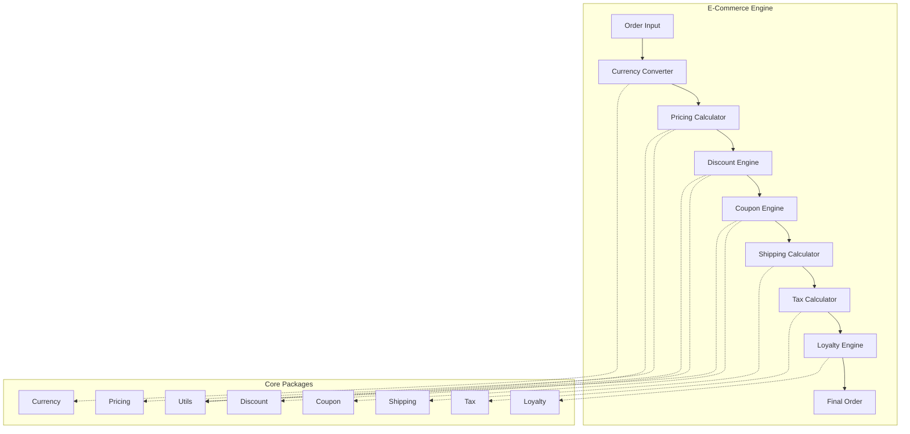
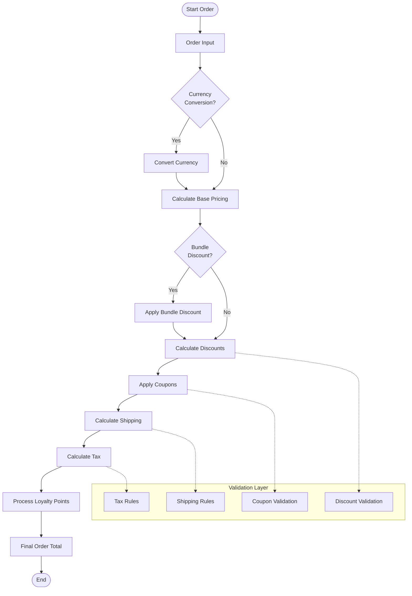
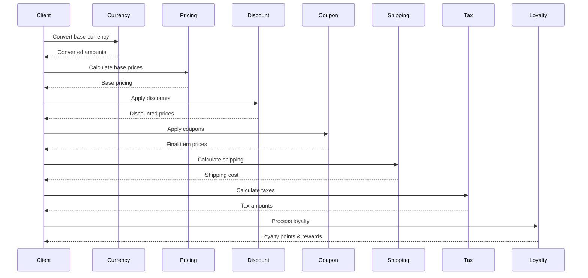

# E-Commerce Engine

Sebuah engine e-commerce yang komprehensif dan modular yang ditulis dalam Go, menyediakan berbagai fitur untuk menghitung harga, diskon, kupon, pengiriman, pajak, loyalitas, dan konversi mata uang.

## 🚀 Fitur Utama

- **💰 Currency**: Konversi mata uang dengan dukungan Rupiah dan mata uang internasional
- **🏷️ Coupon**: Sistem kupon dengan generator, validator, dan kalkulator
- **💸 Discount**: Berbagai jenis diskon (bulk, tier, bundle, loyalty, progressive, dll)
- **🚚 Shipping**: Kalkulasi ongkos kirim berdasarkan zona, berat, dan aturan khusus
- **📊 Tax**: Sistem pajak yang fleksibel dengan berbagai jenis pajak
- **💎 Loyalty**: Program loyalitas dengan poin, tier, dan reward
- **💲 Pricing**: Kalkulasi harga dengan bundling dan tier pricing
- **🔧 Utils**: Utilitas matematika dan generator ID

## 📋 Daftar Isi

- [Instalasi](#instalasi)
- [Struktur Proyek](#struktur-proyek)
- [Arsitektur Sistem](#arsitektur-sistem)
- [Flow Diagram](#flow-diagram)
- [Package Documentation](#package-documentation)
- [Contoh Penggunaan](#contoh-penggunaan)
- [Testing](#testing)
- [Contributing](#contributing)

## 🛠️ Instalasi

```bash
# Install module
go get github.com/masumrpg/ecommerce-engine

# Atau jika ingin menggunakan sebagai dependency dalam project
go mod init your-project-name
go get github.com/masumrpg/ecommerce-engine

# Clone untuk development (opsional)
git clone https://github.com/masumrpg/ecommerce-engine.git
cd ecommerce-engine
go mod tidy

# Run examples
go run examples/main.go

# Run tests
go test ./...
```

### Menggunakan sebagai Dependency

Untuk menggunakan module ini dalam project Go Anda:

```bash
# Dalam project Go Anda
go mod init your-project-name
go get github.com/masumrpg/ecommerce-engine
```

Kemudian import package yang dibutuhkan:

```go
import (
    "github.com/masumrpg/ecommerce-engine/pkg/currency"
    "github.com/masumrpg/ecommerce-engine/pkg/coupon"
    // ... package lainnya sesuai kebutuhan
)
```

## 📁 Struktur Proyek

```
ecommerce-engine/
├── README.md
├── go.mod                   # Go module definition
├── go.sum                   # Go module checksums
├── examples/
│   └── main.go              # Contoh penggunaan semua package
└── pkg/
    ├── coupon/              # Sistem kupon
    │   ├── calculator.go    # Kalkulasi kupon
    │   ├── generator.go     # Generator kode kupon
    │   ├── validator.go     # Validasi kupon
    │   └── types.go         # Definisi tipe data
    ├── currency/            # Konversi mata uang
    │   ├── calculator.go    # Kalkulasi mata uang
    │   ├── constants.go     # Konstanta mata uang
    │   ├── types.go         # Definisi tipe data
    │   └── utils.go         # Utilitas mata uang
    ├── discount/            # Sistem diskon
    │   ├── calculator.go    # Kalkulasi diskon
    │   ├── rules.go         # Aturan diskon
    │   ├── validator.go     # Validasi diskon
    │   └── types.go         # Definisi tipe data
    ├── loyalty/             # Program loyalitas
    │   ├── calculator.go    # Kalkulasi poin loyalitas
    │   ├── rules.go         # Aturan loyalitas
    │   └── types.go         # Definisi tipe data
    ├── pricing/             # Sistem pricing
    │   ├── calculator.go    # Kalkulasi harga
    │   ├── bundling.go      # Bundle pricing
    │   └── types.go         # Definisi tipe data
    ├── shipping/            # Kalkulasi pengiriman
    │   ├── calculator.go    # Kalkulasi ongkir
    │   ├── rules.go         # Aturan pengiriman
    │   └── types.go         # Definisi tipe data
    ├── tax/                 # Sistem pajak
    │   ├── calculator.go    # Kalkulasi pajak
    │   ├── rules.go         # Aturan pajak
    │   └── types.go         # Definisi tipe data
    └── utils/               # Utilitas umum
        ├── generator.go     # Generator ID dan kode
        └── math.go          # Utilitas matematika
```

## 🏗️ Arsitektur Sistem



## 🔄 Flow Diagram

### Complete Order Processing Flow



### Package Interaction Flow



## 📚 Package Documentation

### 💰 Currency Package

Menangani konversi mata uang dengan dukungan berbagai mata uang internasional.

**Fitur:**
- Konversi mata uang real-time
- Dukungan Rupiah (IDR) dan mata uang internasional
- Format mata uang yang dapat dikustomisasi
- Pembulatan otomatis

**Contoh:**
```go
calc := currency.NewCalculator()
calc.SetExchangeRate("USD", "IDR", 15000.0)
result := calc.Convert(currency.ConversionInput{
    FromCurrency: "USD",
    ToCurrency:   "IDR",
    Amount:       100.0,
})
```

### 🏷️ Coupon Package

Sistem kupon lengkap dengan generator, validator, dan kalkulator.

**Fitur:**
- Generator kode kupon otomatis
- Validasi kupon (tanggal, usage limit, eligibility)
- Berbagai jenis kupon (percentage, fixed amount, free shipping)
- Tracking penggunaan kupon

**Contoh:**
```go
generator := coupon.NewGenerator()
codes := generator.GenerateCodes(coupon.GeneratorConfig{
    Count:  10,
    Length: 8,
    Prefix: "SAVE",
})

calculator := coupon.NewCalculator()
result := calculator.Calculate(coupon.CalculationInput{
    Coupon: myCoupon,
    Items:  items,
})
```

### 💸 Discount Package

Sistem diskon yang fleksibel dengan berbagai jenis aturan diskon.

**Jenis Diskon:**
- **Bulk Discount**: Diskon berdasarkan kuantitas
- **Tier Pricing**: Harga bertingkat
- **Bundle Discount**: Diskon paket produk
- **Loyalty Discount**: Diskon berdasarkan tingkat loyalitas
- **Progressive Discount**: Diskon progresif
- **Category Discount**: Diskon berdasarkan kategori
- **Seasonal Discount**: Diskon musiman
- **Cross-sell Discount**: Diskon cross-selling

**Contoh:**
```go
calculator := discount.NewCalculator()
result := calculator.CalculateBulkDiscount(discount.DiscountCalculationInput{
    Items: items,
    Rule: discount.BulkDiscountRule{
        MinQuantity:    5,
        DiscountType:   "percentage",
        DiscountValue:  10.0,
    },
})
```

### 🚚 Shipping Package

Kalkulasi ongkos kirim berdasarkan zona, berat, dan aturan khusus.

**Fitur:**
- Zona pengiriman (nasional, internasional, same-day)
- Kalkulasi berdasarkan berat dan dimensi
- Aturan pengiriman khusus
- Estimasi waktu pengiriman

**Contoh:**
```go
calculator := shipping.NewCalculator()
result := calculator.Calculate(shipping.CalculationInput{
    Weight:      2.5,
    Destination: "Jakarta",
    Zone:        shipping.ShippingZoneNational,
})
```

### 📊 Tax Package

Sistem pajak yang fleksibel dengan berbagai jenis pajak.

**Jenis Pajak:**
- **VAT**: Pajak Pertambahan Nilai
- **Sales Tax**: Pajak Penjualan
- **Luxury Tax**: Pajak Barang Mewah
- **Import Tax**: Pajak Impor

**Contoh:**
```go
calculator := tax.NewCalculator()
result := calculator.Calculate(tax.CalculationInput{
    Amount:   1000.0,
    TaxRules: taxRules,
    Location: "Jakarta",
})
```

### 💎 Loyalty Package

Program loyalitas dengan sistem poin, tier, dan reward.

**Fitur:**
- Sistem poin loyalitas
- Tier pelanggan (Bronze, Silver, Gold, Platinum)
- Reward dan benefit
- Tracking transaksi loyalitas

**Contoh:**
```go
calculator := loyalty.NewCalculator()
result := calculator.CalculatePoints(loyalty.PointsCalculationInput{
    Customer:    customer,
    OrderAmount: 500.0,
    Items:       items,
})
```

### 💲 Pricing Package

Sistem pricing dengan dukungan bundling dan tier pricing.

**Fitur:**
- Kalkulasi harga dasar
- Bundle pricing
- Tier pricing
- Dynamic pricing

**Contoh:**
```go
calculator := pricing.NewCalculator()
result := calculator.Calculate(pricing.CalculationInput{
    Items:        items,
    CustomerTier: "gold",
})
```

### 🔧 Utils Package

Utilitas umum untuk matematika dan generator.

**Fitur:**
- Fungsi matematika (Round, Percentage, etc.)
- Generator ID unik
- Generator kode random

**Contoh:**
```go
// Math utilities
rounded := utils.Round(123.456, 2) // 123.46
percentage := utils.Percentage(150, 10) // 15.0

// Generators
id := utils.GenerateID()
code := utils.GenerateCode(8)
```

## 🚀 Contoh Penggunaan

### Complete Order Example

```go
package main

import (
    "fmt"
    "github.com/masumrpg/ecommerce-engine/pkg/currency"
    "github.com/masumrpg/ecommerce-engine/pkg/pricing"
    "github.com/masumrpg/ecommerce-engine/pkg/discount"
    "github.com/masumrpg/ecommerce-engine/pkg/coupon"
    "github.com/masumrpg/ecommerce-engine/pkg/shipping"
    "github.com/masumrpg/ecommerce-engine/pkg/tax"
    "github.com/masumrpg/ecommerce-engine/pkg/loyalty"
)

func main() {
    // 1. Setup Currency
    currencyCalc := currency.NewCalculator()
    currencyCalc.SetExchangeRate("USD", "IDR", 15000.0)

    // 2. Calculate Base Pricing
    pricingCalc := pricing.NewCalculator()
    items := []pricing.Item{
        {ID: "item1", BasePrice: 100.0, Quantity: 2},
        {ID: "item2", BasePrice: 50.0, Quantity: 1},
    }

    pricingResult := pricingCalc.Calculate(pricing.CalculationInput{
        Items: items,
        CustomerTier: "gold",
    })

    // 3. Apply Discounts
    discountCalc := discount.NewCalculator()
    discountResult := discountCalc.CalculateBulkDiscount(/* ... */)

    // 4. Apply Coupons
    couponCalc := coupon.NewCalculator()
    couponResult := couponCalc.Calculate(/* ... */)

    // 5. Calculate Shipping
    shippingCalc := shipping.NewCalculator()
    shippingResult := shippingCalc.Calculate(/* ... */)

    // 6. Calculate Tax
    taxCalc := tax.NewCalculator()
    taxResult := taxCalc.Calculate(/* ... */)

    // 7. Process Loyalty
    loyaltyCalc := loyalty.NewCalculator()
    loyaltyResult := loyaltyCalc.CalculatePoints(/* ... */)

    // 8. Final Order Total
    finalTotal := pricingResult.TotalAmount -
                 discountResult.TotalDiscount -
                 couponResult.DiscountAmount +
                 shippingResult.Cost +
                 taxResult.TotalTax

    fmt.Printf("Final Order Total: %.2f\n", finalTotal)
}
```

## 🧪 Testing

```bash
# Run all tests
go test ./...

# Run tests with coverage
go test -cover ./...

# Run specific package tests
go test ./pkg/currency
go test ./pkg/coupon
go test ./pkg/discount
# ... etc

# Run tests with verbose output
go test -v ./...
```

## 📈 Performance

Engine ini dirancang untuk performa tinggi dengan:
- Minimal memory allocation
- Efficient algorithms
- Concurrent processing support
- Caching untuk operasi yang sering digunakan

## 🔧 Konfigurasi

Setiap package dapat dikonfigurasi sesuai kebutuhan:

```go
// Currency configuration
currencyConfig := currency.Config{
    DefaultCurrency: "IDR",
    RoundingMode:   currency.RoundingModeHalfUp,
    DecimalPlaces:  2,
}

// Tax configuration
taxConfig := tax.Config{
    DefaultVATRate:    10.0,
    LuxuryTaxRate:    20.0,
    ImportTaxRate:    15.0,
}
```

## 🤝 Contributing

1. Fork repository
2. Create feature branch (`git checkout -b feature/amazing-feature`)
3. Commit changes (`git commit -m 'Add amazing feature'`)
4. Push to branch (`git push origin feature/amazing-feature`)
5. Open Pull Request

### Development Guidelines

- Ikuti Go coding standards
- Tulis unit tests untuk semua fitur baru
- Update dokumentasi jika diperlukan
- Pastikan semua tests pass sebelum submit PR

## 📄 License

MIT License - lihat file [LICENSE](LICENSE) untuk detail.

## 🙏 Acknowledgments

- Terinspirasi dari berbagai e-commerce platform
- Menggunakan best practices dari Go community
- Terima kasih kepada semua contributor

## 📞 Support

Jika ada pertanyaan atau butuh bantuan:
- Buka issue di GitHub

---

**E-Commerce Engine** - Solusi lengkap untuk kebutuhan e-commerce Anda! 🚀