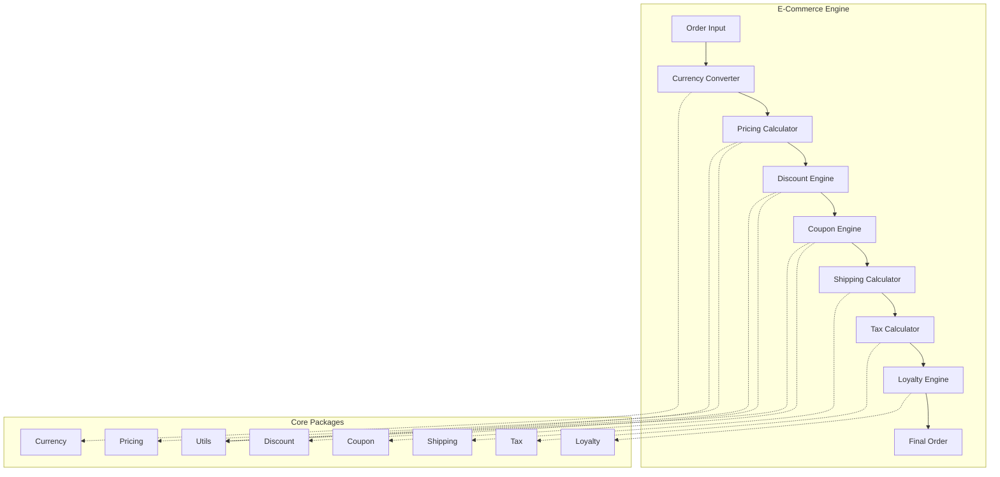
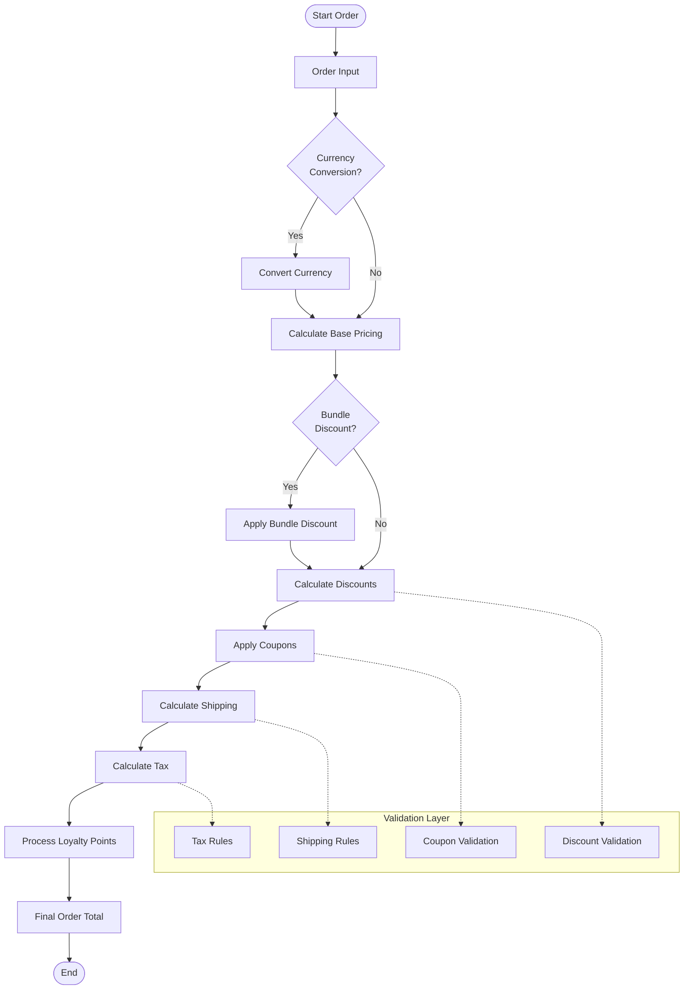
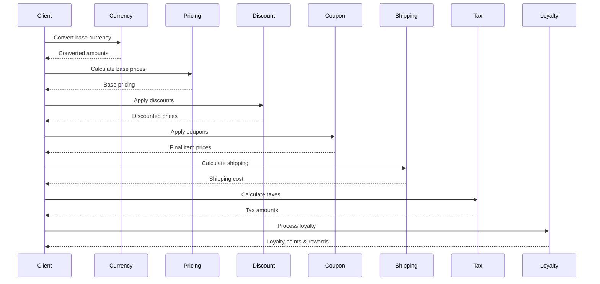

# E-Commerce Engine

A comprehensive and modular e-commerce engine written in Go, providing various features for calculating prices, discounts, coupons, shipping, taxes, loyalty, and currency conversion.

## 🚀 Key Features

- **💰 Currency**: Currency conversion with support for Rupiah and international currencies
- **🏷️ Coupon**: Coupon system with generator, validator, and calculator
- **💸 Discount**: Various types of discounts (bulk, tier, bundle, loyalty, progressive, etc.)
- **🚚 Shipping**: Shipping cost calculation based on zones, weight, and special rules
- **📊 Tax**: Flexible tax system with various tax types
- **💎 Loyalty**: Loyalty program with points, tiers, and rewards
- **💲 Pricing**: Price calculation with bundling and tier pricing
- **🔧 Utils**: Mathematical utilities and ID generators

## 📋 Table of Contents

- [Installation](#installation)
- [Project Structure](#project-structure)
- [System Architecture](#system-architecture)
- [Flow Diagram](#flow-diagram)
- [Package Documentation](#package-documentation)
- [Usage Examples](#usage-examples)
- [Testing](#testing)
- [Contributing](#contributing)

## 🛠️ Installation

```bash
# Install module
go get github.com/masumrpg/ecommerce-engine

# Or if you want to use it as a dependency in your project
go mod init your-project-name
go get github.com/masumrpg/ecommerce-engine

# Clone for development (optional)
git clone https://github.com/masumrpg/ecommerce-engine.git
cd ecommerce-engine
go mod tidy

# Run examples
go run examples/main.go

# Run tests
go test ./...
```

### Using as Dependency

To use this module in your Go project:

```bash
# In your Go project
go mod init your-project-name
go get github.com/masumrpg/ecommerce-engine
```

Then import the required packages:

```go
import (
    "github.com/masumrpg/ecommerce-engine/pkg/currency"
    "github.com/masumrpg/ecommerce-engine/pkg/coupon"
    // ... other packages as needed
)
```

## 📁 Project Structure

```
ecommerce-engine/
├── README.md
├── go.mod                   # Go module definition
├── go.sum                   # Go module checksums
├── examples/
│   └── main.go              # Usage examples for all packages
└── pkg/
    ├── coupon/              # Coupon system
    │   ├── calculator.go    # Coupon calculation
    │   ├── generator.go     # Coupon code generator
    │   ├── validator.go     # Coupon validation
    │   └── types.go         # Type definitions
    ├── currency/            # Currency conversion
    │   ├── calculator.go    # Currency calculation
    │   ├── constants.go     # Currency constants
    │   ├── types.go         # Type definitions
    │   └── utils.go         # Currency utilities
    ├── discount/            # Discount system
    │   ├── calculator.go    # Discount calculation
    │   ├── rules.go         # Discount rules
    │   ├── validator.go     # Discount validation
    │   └── types.go         # Type definitions
    ├── loyalty/             # Loyalty program
    │   ├── calculator.go    # Loyalty points calculation
    │   ├── rules.go         # Loyalty rules
    │   └── types.go         # Type definitions
    ├── pricing/             # Pricing system
    │   ├── calculator.go    # Price calculation
    │   ├── bundling.go      # Bundle pricing
    │   └── types.go         # Type definitions
    ├── shipping/            # Shipping calculation
    │   ├── calculator.go    # Shipping cost calculation
    │   ├── rules.go         # Shipping rules
    │   └── types.go         # Type definitions
    ├── tax/                 # Tax system
    │   ├── calculator.go    # Tax calculation
    │   ├── rules.go         # Tax rules
    │   └── types.go         # Type definitions
    └── utils/               # Common utilities
        ├── generator.go     # ID and code generators
        └── math.go          # Mathematical utilities
```

## 🏗️ System Architecture



## 🔄 Flow Diagram

### Complete Order Processing Flow



### Package Interaction Flow



## 📚 Package Documentation

### 💰 Currency Package

Handles currency conversion with support for various international currencies.

**Features:**
- Real-time currency conversion
- Support for Rupiah (IDR) and international currencies
- Customizable currency formatting
- Automatic rounding

**Example:
```go
calc := currency.NewCalculator()
calc.SetExchangeRate("USD", "IDR", 15000.0)
result := calc.Convert(currency.ConversionInput{
    FromCurrency: "USD",
    ToCurrency:   "IDR",
    Amount:       100.0,
})
```

### 🏷️ Coupon Package

Complete coupon system with generator, validator, and calculator.

**Features:**
- Automatic coupon code generator
- Coupon validation (date, usage limit, eligibility)
- Various coupon types (percentage, fixed amount, free shipping)
- Coupon usage tracking

**Example:
```go
generator := coupon.NewGenerator()
codes := generator.GenerateCodes(coupon.GeneratorConfig{
    Count:  10,
    Length: 8,
    Prefix: "SAVE",
})

calculator := coupon.NewCalculator()
result := calculator.Calculate(coupon.CalculationInput{
    Coupon: myCoupon,
    Items:  items,
})
```

### 💸 Discount Package

Flexible discount system with various types of discount rules.

**Discount Types:**
- **Bulk Discount**: Quantity-based discounts
- **Tier Pricing**: Tiered pricing
- **Bundle Discount**: Product bundle discounts
- **Loyalty Discount**: Loyalty level-based discounts
- **Progressive Discount**: Progressive discounts
- **Category Discount**: Category-based discounts
- **Seasonal Discount**: Seasonal discounts
- **Cross-sell Discount**: Cross-selling discounts

**Example:
```go
calculator := discount.NewCalculator()
result := calculator.CalculateBulkDiscount(discount.DiscountCalculationInput{
    Items: items,
    Rule: discount.BulkDiscountRule{
        MinQuantity:    5,
        DiscountType:   "percentage",
        DiscountValue:  10.0,
    },
})
```

### 🚚 Shipping Package

Shipping cost calculation based on zones, weight, and special rules.

**Features:**
- Shipping zones (national, international, same-day)
- Calculation based on weight and dimensions
- Special shipping rules
- Delivery time estimation

**Example:
```go
calculator := shipping.NewCalculator()
result := calculator.Calculate(shipping.CalculationInput{
    Weight:      2.5,
    Destination: "Jakarta",
    Zone:        shipping.ShippingZoneNational,
})
```

### 📊 Tax Package

Flexible tax system with various tax types.

**Tax Types:**
- **VAT**: Value Added Tax
- **Sales Tax**: Sales Tax
- **Luxury Tax**: Luxury Goods Tax
- **Import Tax**: Import Tax

**Example:
```go
calculator := tax.NewCalculator()
result := calculator.Calculate(tax.CalculationInput{
    Amount:   1000.0,
    TaxRules: taxRules,
    Location: "Jakarta",
})
```

### 💎 Loyalty Package

Loyalty program with points system, tiers, and rewards.

**Features:**
- Loyalty points system
- Customer tiers (Bronze, Silver, Gold, Platinum)
- Rewards and benefits
- Loyalty transaction tracking

**Example:
```go
calculator := loyalty.NewCalculator()
result := calculator.CalculatePoints(loyalty.PointsCalculationInput{
    Customer:    customer,
    OrderAmount: 500.0,
    Items:       items,
})
```

### 💲 Pricing Package

Pricing system with bundling and tier pricing support.

**Features:**
- Base price calculation
- Bundle pricing
- Tier pricing
- Dynamic pricing

**Example:
```go
calculator := pricing.NewCalculator()
result := calculator.Calculate(pricing.CalculationInput{
    Items:        items,
    CustomerTier: "gold",
})
```

### 🔧 Utils Package

Common utilities for mathematics and generators.

**Features:**
- Mathematical functions (Round, Percentage, etc.)
- Unique ID generator
- Random code generator

**Example:
```go
// Math utilities
rounded := utils.Round(123.456, 2) // 123.46
percentage := utils.Percentage(150, 10) // 15.0

// Generators
id := utils.GenerateID()
code := utils.GenerateCode(8)
```

## 🚀 Usage Examples

### Complete Order Example

```go
package main

import (
    "fmt"
    "github.com/masumrpg/ecommerce-engine/pkg/currency"
    "github.com/masumrpg/ecommerce-engine/pkg/pricing"
    "github.com/masumrpg/ecommerce-engine/pkg/discount"
    "github.com/masumrpg/ecommerce-engine/pkg/coupon"
    "github.com/masumrpg/ecommerce-engine/pkg/shipping"
    "github.com/masumrpg/ecommerce-engine/pkg/tax"
    "github.com/masumrpg/ecommerce-engine/pkg/loyalty"
)

func main() {
    // 1. Setup Currency
    currencyCalc := currency.NewCalculator()
    currencyCalc.SetExchangeRate("USD", "IDR", 15000.0)

    // 2. Calculate Base Pricing
    pricingCalc := pricing.NewCalculator()
    items := []pricing.Item{
        {ID: "item1", BasePrice: 100.0, Quantity: 2},
        {ID: "item2", BasePrice: 50.0, Quantity: 1},
    }

    pricingResult := pricingCalc.Calculate(pricing.CalculationInput{
        Items: items,
        CustomerTier: "gold",
    })

    // 3. Apply Discounts
    discountCalc := discount.NewCalculator()
    discountResult := discountCalc.CalculateBulkDiscount(/* ... */)

    // 4. Apply Coupons
    couponCalc := coupon.NewCalculator()
    couponResult := couponCalc.Calculate(/* ... */)

    // 5. Calculate Shipping
    shippingCalc := shipping.NewCalculator()
    shippingResult := shippingCalc.Calculate(/* ... */)

    // 6. Calculate Tax
    taxCalc := tax.NewCalculator()
    taxResult := taxCalc.Calculate(/* ... */)

    // 7. Process Loyalty
    loyaltyCalc := loyalty.NewCalculator()
    loyaltyResult := loyaltyCalc.CalculatePoints(/* ... */)

    // 8. Final Order Total
    finalTotal := pricingResult.TotalAmount -
                 discountResult.TotalDiscount -
                 couponResult.DiscountAmount +
                 shippingResult.Cost +
                 taxResult.TotalTax

    fmt.Printf("Final Order Total: %.2f\n", finalTotal)
}
```

## 🧪 Testing

```bash
# Run all tests
go test ./...

# Run tests with coverage
go test -cover ./...

# Run specific package tests
go test ./pkg/currency
go test ./pkg/coupon
go test ./pkg/discount
# ... etc

# Run tests with verbose output
go test -v ./...
```

## 📈 Performance

This engine is designed for high performance with:
- Minimal memory allocation
- Efficient algorithms
- Concurrent processing support
- Caching for frequently used operations

## 🔧 Configuration

Each package can be configured according to your needs:

```go
// Currency configuration
currencyConfig := currency.Config{
    DefaultCurrency: "IDR",
    RoundingMode:   currency.RoundingModeHalfUp,
    DecimalPlaces:  2,
}

// Tax configuration
taxConfig := tax.Config{
    DefaultVATRate:    10.0,
    LuxuryTaxRate:    20.0,
    ImportTaxRate:    15.0,
}
```

## 🤝 Contributing

1. Fork repository
2. Create feature branch (`git checkout -b feature/amazing-feature`)
3. Commit changes (`git commit -m 'Add amazing feature'`)
4. Push to branch (`git push origin feature/amazing-feature`)
5. Open Pull Request

### Development Guidelines

- Follow Go coding standards
- Write unit tests for all new features
- Update documentation if necessary
- Ensure all tests pass before submitting PR

## 📄 License

MIT License - lihat file [LICENSE](LICENSE) untuk detail.

## 🙏 Acknowledgments

- Inspired by various e-commerce platforms
- Uses best practices from Go community
- Thanks to all contributors

## 📞 Support

If you have questions or need help:
- Open an issue on GitHub

---

**E-Commerce Engine** - Complete solution for your e-commerce needs! 🚀